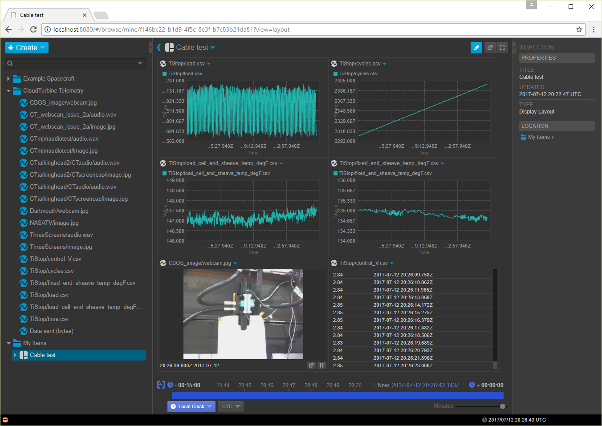

# Installation instructions

This repository contains a forked version of NASA's Open MCT tutorial (https://github.com/nasa/openmct-tutorial) which has been modified to provide an interface to CloudTurbine (CT) data.  Using this interface, CT data served by the CTweb server (a RESTful service) can be viewed in Open MCT.

Setup:

1. Make sure you have node.js and Git installed on your computer.

2. Clone this repository to your local machine

3. After cloning to your local machine, install the openmct-tutorial package by doing the following:
```
cd <openmct-tutorial-install-folder>
npm install
```

4. Install xmldom package:
```
cd <openmct-tutorial-install-folder>
npm install xmldom
```

5. Start one or more local CT sources, such as CTstream or CTmousetrack.  See http://www.cloudturbine.com/ for installation and operation information.

6. Start CTweb on your local computer to serve your CT data.  This server provides a RESTful interface used by the CT/Open MCT interface to fetch CT data for viewing in Open MCT.

7. Start the CT/Open MCT interface:
```
cd <openmct-tutorial-install-folder>
npm start
```

8. View CT data in Open MCT by going to http://localhost:8080

Here's an example of viewing CT data from a cable test at Erigo Technologies using Open MCT.



# Install the CT/Open MCT interface in a full openmct distribution

Follow these steps to install the CT/Open MCT interface in a full Open MCT version (ie, not just the tutorial version).  In the instructions below, it is assumed that you have already installed the CT/Open MCT interface (per the instructions above) and that you have installed the full version of Open MCT in a folder called ```openmct```.

1. Copy content of folder example-server to openmct/example-server

2. Copy content of folder lib to openmct/lib

3. Backup openmct/index.html to openmct/index_ORIG.html

4. Copy the following 6 files to openmct:
  * ct-dictionary-plugin.js
  * dictionary.json
  * dictionary-plugin.js
  * historical-telemetry-plugin.js
  * index.html
  * realtime-telemetry-plugin.js

5. Edit the new openmct/index.html file; change instances of `node_modules/openmct/dist` to `dist`

6. Copy openmct/package.json to openmct/package_ORIG.json

7. Edit openmct/package.json:
  * in the `scripts` section, change the `"start"` line to the following: `"start": "node example-server/server.js"`
  * add the following in the `dependencies` section: `"ws": "^2.0.3"`

8. Install xmldom package:
```
cd openmct
npm install xmldom
```

9. Start one or more CT sources and CTweb

10. Start openmct (`npm start`) and view CT data in Open MCT by going to http://localhost:8080.
