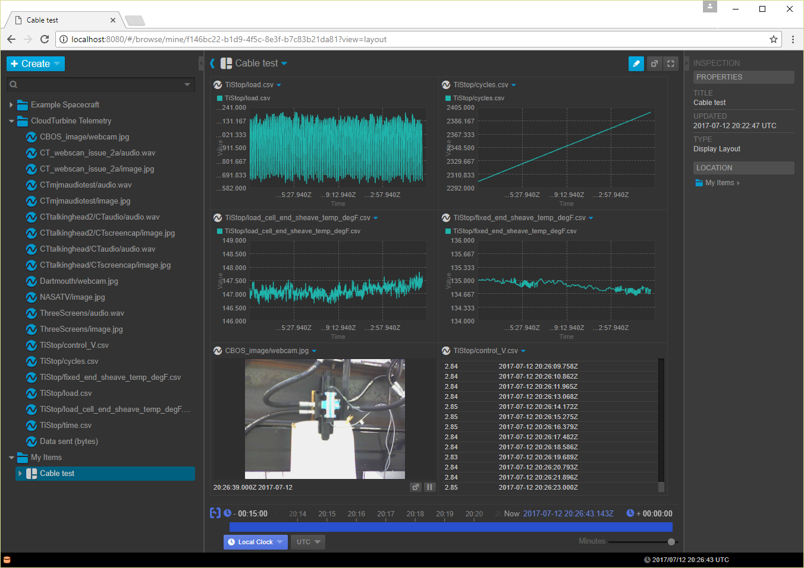

## Install the CT/Open MCT integration in a full openmct distribution

Follow these steps to setup this CT/Open MCT integration in a full Open MCT version (ie, not just the tutorial version).  It is assumed the full Open MCT is stored in a folder called openmct.

1. Copy content of folder example-server to openmct/example-server

2. Copy content of folder lib to openmct/lib

3. Backup openmct/index.html to openmct/index_ORIG.html

4. Copy the following 6 files to openmct:
  * ct-dictionary-plugin.js
  * dictionary.json
  * dictionary-plugin.js
  * historical-telemetry-plugin.js
  * index.html
  * realtime-telemetry-plugin.js

5. Edit the new openmct/index.html file; change instances of `node_modules/openmct/dist` to `dist`

6. Copy openmct/package.json to openmct/package_ORIG.json

7. Edit openmct/package.json:
  * add the following in the `scripts` section: `"start": "node example-server/server.js"`
  * add the following in the `dependencies` section: `"ws": "^2.0.3"`

8. Install xmldom package:
```
cd openmct
npm install xmldom
```

Here's an example of viewing CT data from a cable test at Erigo Technologies using Open MCT.


